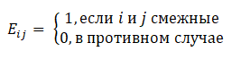
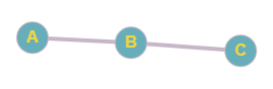

# Отчет по домашнему заданию
---
### (Алгоритмы и структуры данных)
---

### Условие задачи:
###### `Постройте алгоритм, который принимает на вход набор целых неотрицательных чисел и переупорядочивает их так, чтобы сумма любых двух соседних чисел была полным квадратом (или выводит ответ, что это невозможно)`
#
---
## Теоретическая часть:
---
Для доказательства, что данная задача лежит в классе NP, сведем ее к задаче "Гамильтонов путь"(лежащей в NP).
##### Ход доказательства:
1) Пусть задача "Гамельтонов путь" принимает на вход матрицу E (размер nxn), которая составляется по следующему принципу:
 
 На выход получаем `true`, если Гамельтонов путь найден, `false` в противном случае.
 ---
##### Пример:
 Входные данные:
 | |A|B|C|
 |-|-|-|-|
 |A|`0`|`1`|`0`|
 |B|`1`|`0`|`1`|
 |C|`0`|`1`|`0`|
 В виде графа: 
 
Выходные данные:
`true`

---
2) Входные данные решаемой задачи: набор целых неотрицательных чисел.
Составим матрицу по следующему принципу:
.png)
`Важно:` главная диагональ состоит из `0`
---
##### Пример:
Входные данные: `1, 3, 1, 8, 8`
В виде матрицы:
 | |1|3|1|8|8|
 |-|-|-|-|-|-|
 |1|`0`|`1`|`0`|`1`|`1`|
 |3|`1`|`0`|`1`|`0`|`0`|
 |1|`0`|`1`|`0`|`1`|`1`|
 |8|`1`|`0`|`1`|`0`|`1`|
 |8|`1`|`0`|`1`|`1`|`0`|
 В виде графа:
 .png)
 ---
 Подадим эту матрицу в задачу "Гамельтонов путь". Если `true`, то существует путь через все вершины и они посещены ровно один раз, а значит, что это и есть нужная нам последовательность чисел (сумма любых двух соседних чисел является полным квадратом).
 Доказано.
 